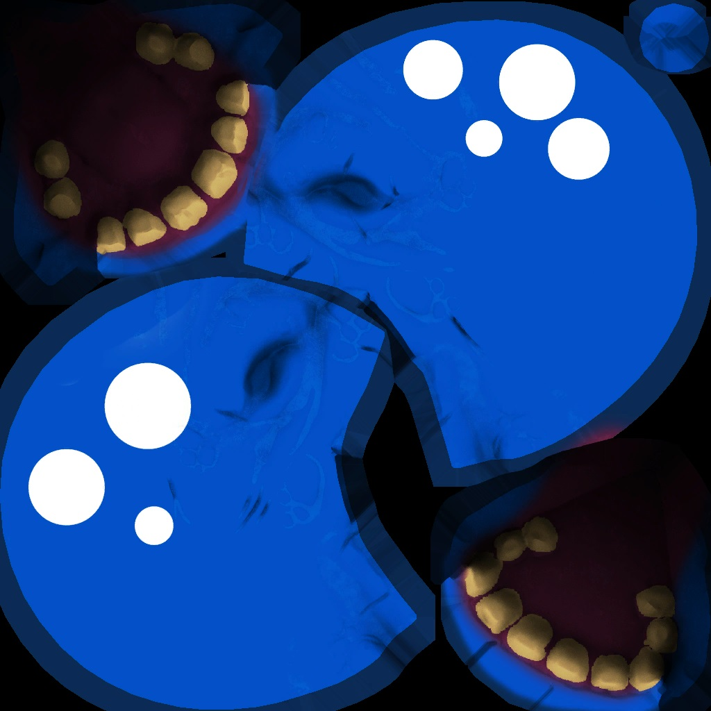

# Tutorial: Remaking the blob

## Intro
The idea is to recreate the blob from the original documentation.

But rebranding it to this:

Lets get started

## The tools
The following tools are the tools I used to create the blob, obviously, other software can be used ( Except Max, cuz that is where I wrote the tools for )

|Tool|Description|Url
|--|--|--|
|3D Studio Max| With Reforged tools installed, see the documentation for installation|[Autodesk 3DS Max](https://www.autodesk.com/products/3ds-max/free-trial)
|ZBrush|for sculpting and creating the high poly model  [Free version: ZBrush Core Mini](https://zbrushcore.com/mini/) |[ZBrush](https://pixologic.com/)
|Substance Painter|for baking maps and giving it color  [Get Substance painter for free](https://www.youtube.com/watch?v=0uKH4S7QD44)|[Substance Painter](https://www.substance3d.com/)
|Photoshop (or gimp)|Used to adjust, create and correct the textures | [Photoshop](https://www.adobe.com/be_en/products/photoshop.html) or [GIMP](https://www.gimp.org/)

For modeling or sculting you can also use, Maya, Blender, 3DCoat, ... etc

## Block out

I like to start with a rough blockout before starting to sculpt.

Create 3 spheres, 2 for the eyes and 1 for the body, cutout the mouth.

 Make sure the body is centered in the X- Axis and the eyes are in equel distance from the center

Attach both eyes to each other so they make 1 object and name the objects accordingly.

Export this to FBX ( This allows us to seperate the pieces in ZBrush)

## Sculpting

Sculpting can be a lengthy process, especially when you are a beginner. Anatomy is key, even with a blob. So sculpt away !

I used the Clay Buildup brush to create the eyebrowse and the teeth.
With the Damian Standard brush I made the sharp edges and the nicely carved lines.
With the Orb brush ( from the Lightbox) I made the cut outs, rocks on his face and scratches.

Once you are done, press control +A to select all ( from the active layer ) and export to OBJ. The eyes are not necessary as they were just there for positioning purposes.

In ZBrush you can retopolize the object and export that again as the main mesh, go as low as you want without it actually loosing mass.

This can be optimized again (3x) to get decent LOD levels.

## UV Unwrap

Before stepping to texturing and baking etc. We need a decent UV map. I usually split up convex parts ( like the eyes ) and cut the object right through the middle to have something interest.
This is how my unwrap looks like:

I usually use the **Relax Tool** once I selected an island of faces. Play around with the options in the dropdown to make it easier.

In the tools meny render out 2 maps, 1 - the uv map and 2 - a solid map, this will come in handy in the photoshop moment to clean up and verify your textures.

## Baking maps

### Exporting the cage

Select the objects in Max and export them as OBJ, make sure to have the following options:
- Check Texture Coordinates
- Check Smoothing Groups
- Check normals
- Uncheck export materials
- Uncheck create mat - library
- Select Triangles in the Faces dropdown
This is the "cage" object file

### Baking

Open Adobe Substance Painter and select the cage object file, as template I used the PBR Metallic Roughness shader.

In the Texture Set Settings, scroll down and select Bake Mesh Maps, now select the high poly object file (exported from ZBrush)
As additional settings, I set the Max Frontal and Rear Distance to 0.5.
This will generate normal, curvature, ambient occlusion, height, distance, etc... maps for us.

### Coloring

Next: coloring, materials, smart, materials etc... go wild and use your imagination

For quick result I selected the Machinery Smart material and changed the base colors to blue-ish.

...after hours of tweaking ... you will find something interesting (and notice that later on it will not even be visible in game)

### Exporting

Press CTRL + SHIFT + E to export to textures

To make my life easier, I created my own output template based on the other templates ( PBR Metallic Roughness). It is nice to make it possible to generate a fitting ORM map here. I'm not a wizard or an experienced user of this tool, however it took not more than half an hour to get this set up. I exported them as .png .

## Textures

### Converting to dds files

For safe keeping, do NOT delete the original exported files, they may still come in handy later.
I used Photoshop CS6 for this as the DDS Plugin from nvidia supports the ATI2N normal map for Reforged.

### Diffuse map

As mentioned in the documentation, the format is DXT5 ( RGBA ). With the alpha channel being used as the mask ( alpha map : black for transparent, white for opaque )
As this model does not have any masked areas, the Alpa channel is completely white.

Additionally, the parts that are white(ish) are later used as Team Color. Team color is defined in the ORM map ( see later )

### Normal map

As mentioned in the documentation, the format is ATI2N ( ). This format only stores the R & G channel.

With the alpha and blue channel completely white.

**NOTE:** If you exported this texture from Substance Painter, invert the R & G channel!!

### Emission Map

As mentioned in the documentation, the format is DXT1 (RGB) where the color is used as emission. This is what gives the eyes the effect of glowing.
If you do not use an emission map, select the black32.dds file from the assets/textures/

This file will be exported as its original file and does not need to be uploaded in the editor.

### ORM Map

As mentioned in the documentation, the format is DXT5 ( RGBA ).
The channels in the ORM map serve multiple purposes.

|Channel|Map|Description
|--|--|--|
|R|Ombient Occlusion Map|White:no shadow, black: shadow
|G|Roughness Map|white: no 'dirt' or reflection, black: dirt, empty would mean rgb (128 12 128)
|B|Metallic|White: full metal, black: no metal
|A|Team Color|White: team color, black: no team color

### Environment Map

As seen in almost all unit models, there is a texture called environmentmap.dds

And it points to a shared texture. Please select this if you want spherical reflection ( used by metal ) to happen.

As the black32.dds file, it is not required to upload this in the editor. It is mapped at export to the specific environmentmap ingame.

## Animation Sequence

The export will, if there is no animation sequence, add a Stand animation by default.

Open the animation selector window and add one. 
In the properties, fill in the Start, End frames, enter the name Stand and press Add.

Additional animations can be added ( or manually if anything goes wrong via the global note track in the dopesheet)

## Bones

Set up some bones to actual animate our blob.

This is how I have set up my bone structure:

## Skinning

Time to add these bones to the model. In the modifier panel add the Skin modifier and add the bones you want to add to the model.

I added BONE_HEAD and BONE_JAW

And weighted them accordingly.

## Animation

Set the animation slider to start frame 10 and end frame 70 (frames of the Stand animation ) 

And animation your blob. Note that, since this is a looping animation, that the start and endframe transformation for the bones are identically positioned ( you can copy them by SHIFT dragging the note on the trackbar )

## Collision Objects

Now create a sphere around you model, select the sphere.

Rename it to B_KGS_ROOT.  
There must always be a B_KGS_ROOT, else it is not selectable in the editor and no collision will happen.

Any collision object **MUST** start with **B_KGS_**

Open the **User Properties** from the WC3 Reforged Tools menu and set it to Collision box.

## Attachment Points

From the Create panel ( or menu ) add at least the Origin attachment point.  
For a full list of approved names, please refer to the 'old' documentation.

## Ribbon Emitter

Create a Warcraft III Reforged Standard material and add a texture to the Diffuse map slot. 
Set the options to Unlit & 2-Sided and the Filter mode to blend.

Drag and drop the material to the material slot of the Ribbon.

Set the Above and Below size so that it matches the width of our Blob.

## Facial FX

Facial Effects are supported for export, but there is no validation during export, it is based on a single file.

## Popcorn FX

Popcorn Effects are supported for export, but there is no validation during export, it is based on a single file and some properties in the UI.

## Lights

As described in the Documentation, Lights are supported. Use the standard light types from 3DS Max in the Create panel.

Use the far attenuation and set the Start and End value. Use the multiplier and the color. All other settings are not taken into account.

## Events

Add an Event object ( found in Create, Helpers, Warcraft III Reforged, and then Event )
For a complete list of events, please refer to the official documentation.

Navigate to the frame when the event takes place and press the add button on the properties of the event object.

