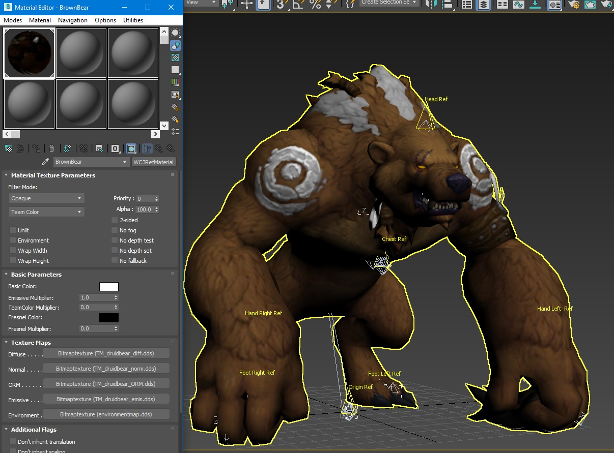

# Tutorial: Converting World of Warcraft model to Warcraft III Reforged

## Intro
The idea is to convert a (creature) model from World of Warcraft to Warcraft III Reforged.
For this tutorial I took the druid bear creature.

## The tools

|Tool|Description|Url
|--|--|--|
|XnView|used to convert the .blp files to .png|[XnView](http://www.xnview.com)
|3D Studio Max||[Autodesk 3DS Max](https://www.autodesk.com/products/3ds-max/free-trial)
|Photoshop (or gimp)|Used to adjust, create and correct the textures | [Photoshop](https://www.adobe.com/be_en/products/photoshop.html) or [GIMP](https://www.gimp.org/)
|WoW.Export|Used to look at and extract the models|[WoW.Export](https://github.com/Kruithne/wow.export)
|Warcraft III Reforged Tools||[Warcraft III Reforged Art Tools](https://github.com/TaylorMouse/warcraft_III_reforged_tools)
|WoW M2 Import Script|I converted this so it is better to use|[M2 Import Plugin](https://github.com/TaylorMouse/MaxScripts/blob/master/GriffonStudios/GriffonStudios_WorldOfWarcraft_ImportM2.ms)

## STEP 1 : Choosing the WoW Creature

Start up the WoW.Export Tool


At the bottom left, just enter the name of a model you like to find, here I looked for bear.

Select your favorite bear.

Select everything on the right hand side to export the raw data

Press "export as M2/WMO(raw)"


## STEP 2 : Converting the textures

For this creature there are a few skins ( different colors ).

I will be going for the brown one and add some parts that makes it team colored ( here the white skin comes into place)

I will also be using the white skin for the team colored parts.

So in XnView select the textures and convert them into .TGA. Later, in photoshop we will convert them to .dds


## STEP 3 : Importing the m2 model

Make sure you installed the Art Tools and the m2 import script in the StartUp folder of your 3D Studio Max Script folder. ( see the tutorial on how to achieve that )

Start 3D Studio Max and navigate to the Utilities tab and select the MAXScript button. Select the Import Utility from the dropdown.


Make sure that you exported the db files from WoW and put it in a folder so you can reference to it in the Import Settings.

Amp the scale up to about 25. The FPS to 30 like in the image below:


Now browse for your creature ( .m2 model ) and its matching .skin file. 

This will bring up a second window that shows you the geometry and a list of animations.

Leave the geometry list as is, and switch to the animation tab. Only select what you need. Most of the animations are not needed.

HINT: Emotes tend to screw up the animation, so be aware of this.

At least check the boxes for Stand, Death, Run and Attack as these are the minimum animations required for a creature.

After a few seconds this should be imported correctly.


## STEP 4 : Applying the texture

In Max, open the Material editor ( Press M) and select Warcraft 3 Reforged Standard Shader


Select the bear ( while the material editor is still open) and press the "Assign material to the selection" button

Now in the diffuse map, add the TGA from the creature ( don't worry we'll change that soon )

If you don't see the texture in the viewport of max, don't forget to press the "Show shaded material in viewport" button.


## STEP 5 : Animation

Check the imported animation with the Animation Window ( from the WC3 Reforged Tools) 
If you see a "GLstand" animtion, delete it.

Don't forget to save your work from time to time.

## STEP 6 : Recreate the Attachments

These attachments are only used in WoW and are only point helpers, and as you 'll see there are quite a few.

So you need to go over them one by one and delete them and recreate them using WC3RefAttachments. To make sure it is correct, verify the official documentation for naming conventions.

You can find the attachment in the menu or in the Create tab in the Helper section.


Or you can run the following script to convert the points to WC3RefAttachments:

```
(
    clearListener()
    
    local points = #()
    for obj in objects where classof obj == Point do (
        local newName = obj.name
        obj.name = obj.name + "_OLD"
        local newObj = WC3RefAttachment()
        newObj.name = newName
        newObj.pos = obj.pos
        newObj.parent = obj.parent
        print newObj.Name
    )
    
    for i=1 to points.count do
        delete points[i]
    
    gc()
)
```

You still need to remove/rename the point you want to keep.

## STEP 7 : Creating the Textures

Open the TGA file previously converted from the blp file.

We need 4 texture, diffuse, normal, ORM and emissive. ( And a fifth that is always the environmental map)

In the blp file there is a lot of info, the color, the mask and the reflection.
The color is the RGB, the mask is the alpa map where the color is black and the reflection is the light gray color in the alpha map.

Map out the team color locations and make that white. You can also copy these part from a white skin if you like.

See my reforged documentation to create these textures correctly.

Since I removed the part that needs a mask, I ended up with this, and converted it to a dds DXT5


I used the white map to create a normal map in Photoshop using the 3D filter.

I used the white map as the occlusion map and the light color from the alpha ( blp ) to create the roughness. No need to have metal on this character, so leave that channel black.

So after applying these textures to the correct slot you should have something like this



## STEP 8 : Time to Export

In the Tools menu, hit the export button. Mine took about 7 seconds to export. Now go the mdx sanity test website [Hive Workshop mdx sanity tester](https://viewer.hiveworkshop.com/check/) and drag and drop to see if everything works fine.


## STEP 9 : Time to tweak

I amped up the emissive mutliplier in the material so his eyes glow a little better.

In the animation, turn off the loop for death animation and rename the battleroar to spell. As BattleRoar is not a standard name for an animation.

Add the collision objects to this model to make it selectable in game. 
Don't forget to check the documentation on how to create these.
Add the Death Decay animation so he sinks in the ground.

## STEP 10 : In game

Open the editor and import the files (press F12) make sure to remove the path from the imported textures. You don't need to import the environmentmap.dds as it will take it from the game.

Open the Units Object editor and change one of the models to your imported model.

Final result:


All files can be found here: [TM Druidbear](Resources/TM_Druidbear.zip)

3DS Max 2020 file is included.